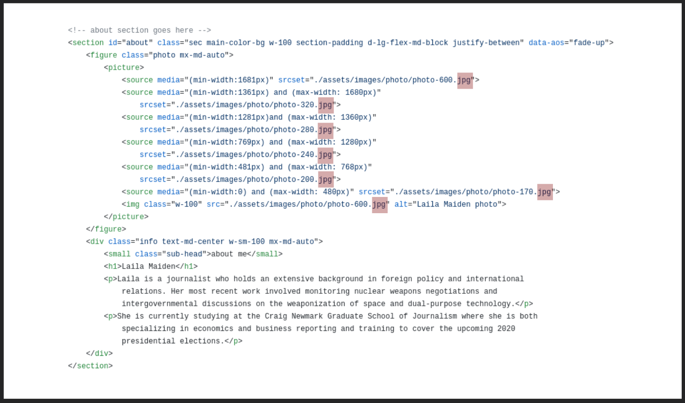
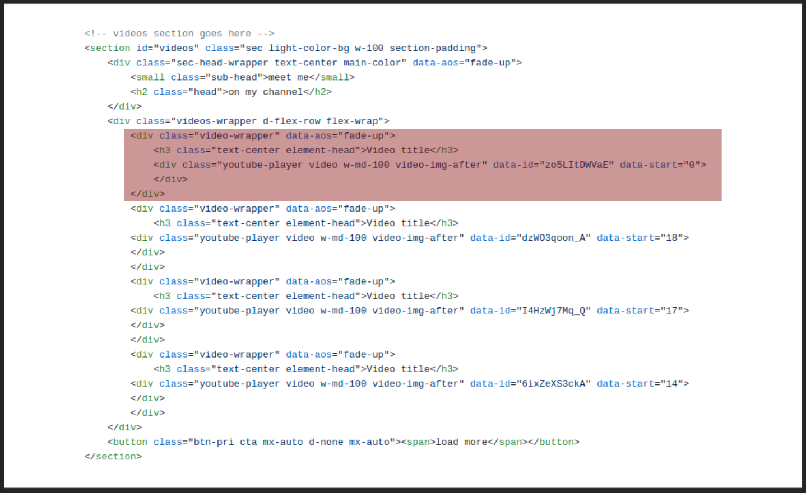

# Personal Biography Website
This documentation created to help in future editing to add or remove items on this website.

- **[Files Organization](#files):** How to deal with files.
- **[Page Speed](#speed):** Speed analysis.
- **[About](#about):** How to edit the about section.
- **[Videos](#videos):** How to add / remove video.
- **[Articles](#articles):** How to add / remove article.
- **[Audios](#audios):**  How to add / remove podcast.
- **[Contact Section](#contact):**  How to edit "Contact Section".
- **[Copyright Section](#copyright):**  How to edit Copyright Section.

## <a name="files" target="_self">Files Organization</a>

### 1- Root

It's include: 
- `index.html`: the main page of the site
- favicon of site
- `README` file (this documentation)
- `assets` folder
- `wav` folder

### 2- assets folder

It's include:
- articles folder
- documentation-assets folder
- images folder
- scripts folder
- style folder

#### a- articles folder

It's include all articles `.PDF` files.

#### b- documentation-assets folder

It's include the images of this documentation.

#### c- images folder

It's include:
- article1 folder
    - include images with different sizes for the first article.
- article2 folder
    - include images with different sizes for the second article.
- article3 folder
    - include images with different sizes for the third article.
- article4 folder
    - include images with different sizes for the forth article.
- logo folder
    - include images with different sizes for the logo.
- photo folder
    - include images with different sizes for the intro (about) section.
- `play` photo (for videos section).
- `play-hover` photo (for videos section).

##### Note: Article images sizes are

- width: 800px.
- width: 310px.
- width: 260px.
- width: 200px.

##### Note: logo sizes are

- Width: 630px.
- Width: 430px.
- Width: 320px.
- Width: 215px.
- Width: 180px.
- Width: 150px.
- Width: 100px.

##### Note: Intro photo sizes are

- Width: 600px.
- Width: 320px.
- Width: 280px.
- Width: 240px.
- Width: 200px.
- Width: 170px.

#### d- scripts folder

It's include:
- `index.js`: The javascript for site (ES6+).
- `index-es5.js`: The javascript for site (ES65 for older browsers).
- `index.min.js`: The minified file (to increase site speed). It's transformed from the `index-es5.js` file.

#### e- style folder

It's include:
- `style.css`: The styles for the website.
- `style.min.css`: The minified file (to increase site speed). It's transformed from the `style.css` file.

### 3- wav folder

It's include all podcast files.

## <a name="speed" target="_self">Page Speed</a>

Speed analysis has been done on [https://biosite5.netlify.app/](https://biosite5.netlify.app/) and The results are as follows:

### Pagespeed Insights from Google

#### 1- For mobile

#### 2- For desktop

### Gtmetrix

## <a name="about" target="_self">About</a>

If you want to update the about section, Then This will help you

### 1- update the photo

- Prepare the photo (Portrait orientation). For page speed, You need these sizes:
    - Width: 600px. It's name should be: `photo-600`.
    - Width: 320px. It's name should be: `photo-320`.
    - Width: 280px. It's name should be: `photo-280`.
    - Width: 240px. It's name should be: `photo-240`.
    - Width: 200px. It's name should be: `photo-200`.
    - Width: 170px. It's name should be: `photo-170`.
    - The current photos' format is `.jpg`. So, It's preferred that the new photos to be in same format. Or you'll need to edit the `index.html` file. If you want to edit it, follow the instructions below.
    - Replace the new photos with that included in the folder in `assets/images`. It's name: `photo`.

#### In case that the photo isn't `.jpg`

### 2- update the biography

- To add the Paragraphs: Include each paragraph in `
PARAGRAPH
` and replace `PARAGRAPH` with you'r paragraph.
- Then, replace this piece in `index.html` with the new Paragraphs. Or, just add the new ones.

## <a name="videos" target="_self">Videos</a>

### 1- Remove a video

- Select which video to delete and know its arrangement among videos elements.
- Delete The `div` element from the `index.html` document (look at picture);

### 2- Add a new video

- First: Determine the video arrangement between the videos for the page
- Then: copy this code `

                        <h3 class="text-center element-head">VIDEO_TITLE</h3>
                        

                        

                    
`
- Replace `VIDEO_TITLE` with the title you want.
- Replace `VIDEO_ID` with the youtube video id. You can find it in the video URL on youtube (look at picture);

- If you want video to start in a specific second, replace the `0` in ` data-start="0"` with the specific second. Ex: ` data-start="16"`
- Finally: Past the code in the `index.html` document in the arrangment you determined before.

## <a name="articles" target="_self">Articles</a>

### 1- Remove an article

- Select which article to delete and know its arrangement among articles elements.
- Delete The `article` element from the `index.html` document (look at picture);

### 2- Add a new article

- First: Determine the article arrangement between the articles for the page.
- Then you need to prepare the following:
    - The article title
    - The article URl if possible
        - If there is no article link and you want to link with a `.PDF` file, then you need to add this file to the article folder. It's locate at `assets/articles`.
    - The top two or three paragraphs (or whatever you want) of the article.
    - The article Images. For page speed, You need these sizes:
        - Width: 200px. It's name usually: `article0-200` (instead of `0`, add the article arrangement)
        - Width: 310px. It's name usually: `article0-310` (instead of `0`, add the article arrangement)
        - Width: 800px. It's name usually: `article0` (instead of `0`, add the article arrangement)
        - Create a new folder in `assets/images`. It's name usually: `article0` (instead of `0`, add the article arrangement).
        - Put all the article images in this new folder.
        
        Note that: the `200` is the only "square" image, While others are "Landscape orientation".

- Then: copy this code:
     `<article class="d-lg-flex-md-block justify-between text-sm-center">
                            <figure class="article-img w-md-100 mx-md-auto">
                                <picture>
                                    <source media="(min-width:1681px)" srcset="./assets/images/article1/article1.jpg">
                                    <source media="(min-width:1281px) and (max-width: 1680px)"
                                        srcset="./assets/images/article1/article1-310.jpg">
                                    <source media="(min-width:769px) and (max-width: 1280px)"
                                        srcset="./assets/images/article1/article1.jpg">
                                    <source media="(min-width:0px) and (max-width: 768px)"
                                        srcset="./assets/images/article1/article1-200.jpg">
                                    
                                </picture>
                            </figure>
                            

                                

                                    <h3><a href="http://bizeconreporting.journalism.cuny.edu/2020/05/26/trucking-takes-the-long-winding-road-downwards/"
                                            target="_blank">Trucking
                                            Takes The Long Winding Road Downwards</a></h3>
                                    <time class="p" datetime="2020-05-26">26-05-2020</time>
                                

                                
When COVID-19 first hit, Tali Haleua, founder of Fuelogistics from Salt Lake City,
                                    Utah, thought he could get by for a few weeks covering expenses out of pocket, but
                                    then the lockdowns dragged on. Eventually, he had to lay off all 10 of his
                                    employees. Now his trucks are sitting idle and he isn’t sure what comes next.

                                
“Shippers were cutting their rate so low that it was less than what it cost us to
                                    drive our trucks,” said Haleua.

                            

                        </article>`

- It's a little big piece of code due to performance and page speed issues. However, It's easy to edit.

#### Add the article Picture

- To add the article pictures, That we have prepared in advance, just replace these pieces of code with images names

#### Add the article URL

- To add the URL, Replace this piece with the URL.

- If There's no URL and just a PDF file, copy This: `./assets/articles/FILE_NAME.pdf` and replace `FILE_NAME` with your pdf file name.

Note: It's preferred that the file name does not contain any spaces, but instead `- `or `_`.

#### Add the article Title

- To add the Title, Replace this piece with the Title.

#### Add the article Date

- To add The date: Replace This part with the date in `"YYYY-MM-DD"` format (you `can't` change the format)

- And This part with the date in `DD-MM-YYYY` formate (you `can` change the format)

#### Add the article Paragraphs

- To add the Paragraphs: Include each paragraph in `
PARAGRAPH
` and replace `PARAGRAPH` with you'r paragraph.
- Then, replace this piece with the Paragraphs.

- Finally: Past the code in the `index.html` document in the arrangment you determined before.

## <a name="audios" target="_self">Audios</a>

### 1- Remove an audio

- Select which podcast to delete and know its arrangement among audios elements.
- Delete The `div` element from the `index.html` document (look at picture);

### 2- Add a new audio

- First: Determine the podcast arrangement between the podcasts for the page.
- Add the audio file to `wav` folder. It's locate in `assets` folder.
- Then: copy this code: 
                    `

                        <h3 class="text-center element-head">PODCAST_TITLE</h3>
                        <audio loading="lazy" controls="" preload="metadata">
                            <source src="https://leilahmaidan.github.io/portfolio/wav/PODCAST.wav"
                                type="audio/wav">
                            Your browser does not support the audio element.
                        </audio>
                    
`
- Replace `PODCAST_TITLE` with the podcatst title that you want. 
- Replace `PODCAST` in `https://leilahmaidan.github.io/portfolio/wav/PODCAST.wav` with the audio name.

Note 1: It's preferred that the file name does not contain any spaces, but instead `- `or `_`.
Note 2: If the File extension not `wav`, then replace `.wav` with the file extension. Ex: `.mp3`.

- Finally: Past the code in the `index.html` document in the arrangment you determined before.

## <a name="contact" target="_self">Contact Section</a>

To edit The contact information:

## <a name="copyright" target="_self">Copyright Section</a>

In case you want to update the copyright section, you'll need to update it in two different locations in the document.

### 1- At the top of document

It's for SEO. Just follow The picture:

### 1- At the bottom of document

That's what appear in your website.

